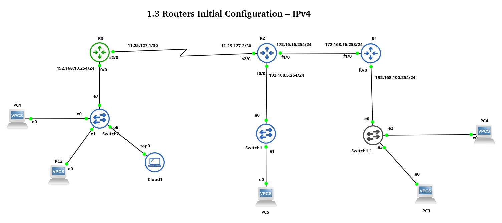

# Lab 1.3 — Routers Initial Configuration (IPv4)

> **CCNA-level lab** covering Cisco IOS initial configuration, IP addressing, password security, and VTY remote access on a multi-router topology built in GNS3.



---

## Overview

This lab simulates a **branch-office network** with three Cisco routers, switches, and end devices. You will perform the foundational configuration that every Cisco router needs before it can participate in a routed network.

| Skill tested | IOS concept |
|---|---|
| Hostname & banner setup | `hostname`, `banner motd` |
| Interface IP assignment | `ip address`, `no shutdown` |
| Password security | `enable password`, `line console`, `line vty` |
| Remote access (SSH/TELNET) | `line vty 0 15`, `exec-timeout`, `logging synchronous` |
| Domain lookup control | `no ip domain-lookup` |
| Configuration management | `copy running-config startup-config` |

---

---

## IP Addressing Table

| Device | Interface | IP Address | Subnet Mask | Description |
|--------|-----------|------------|-------------|-------------|
| **R1** | Fast1/0 | 172.16.16.254 | 255.255.255.0 | Link to R2 |
| | Fast0/0 | 192.168.100.254 | 255.255.255.0 | Link to LAN |
| **R2** | Fast1/0 | 172.16.16.253 | 255.255.255.0 | Link to R1 |
| | Fast0/0 | 192.168.5.254 | 255.255.255.0 | Link to LAN |
| | Serial2/0 | 11.25.127.1 | 255.255.255.252 | Link to R3 |
| **R3** | Fast0/0 | 192.168.10.254 | 255.255.255.0 | Link to LAN |
| | Serial2/0 | 11.25.127.2 | 255.255.255.252 | Link to R2 |

---

## Tasks

- [ ] **1.** Configure hostnames and interface IP addresses on all routers per the addressing table
- [ ] **2.** Set enable password to `ccna` and console/access password to `cisco`
- [ ] **3.** Configure 16 remote access (VTY) lines on every router
- [ ] **4.** Set VTY idle timeout to **1 minute** (`exec-timeout 1 0`)
- [ ] **5.** Configure end-device (PC) IP addresses and default gateways

---

## Folder Structure

```
.
├── 0.Task/
│   ├── task.txt              # Lab task description
│   └── checklist.html        # Interactive progress checklist
├── 1.Topology/
│   └── lab-01.png            # GNS3 topology screenshot
├── 2.Config_files/
│   ├── R1_i1_startup-config.cfg
│   ├── R2_i2_startup-config.cfg
│   ├── R3_i3_startup-config.cfg
│   └── R3_i3_private-config.cfg
├── 3.Tables/
│   └── ip_add.csv            # IP addressing table (CSV)
├── 4.Captures/
│   └── *.pcapng               # Wireshark packet captures
├── Lab/
│   ├── IPv4_Config.gns3      # GNS3 project file
│   └── project-files/        # Dynamips / VPCS / QEMU files
└── README.md
```

---

## Requirements

| Tool | Version |
|------|---------|
| [GNS3](https://www.gns3.com) | 2.2+ |
| Cisco IOS image | c7200 / c3725 (or compatible) |
| [VPCS](https://github.com/GNS3/vpcs) | built into GNS3 |
| Wireshark | any recent release |

---

## Quick Start

1. **Clone** this repository.
2. Open `Lab/IPv4_Config.gns3` in GNS3.
3. Start all devices and wait for IOS boot.
4. Follow the tasks above — refer to `0.Task/task.txt` for details.
5. Use `2.Config_files/` as reference once you complete each router.

---

## Verification Commands

```
show ip interface brief
show running-config
show ip route
ping <destination>
telnet <vty-ip>
```

---

## Keywords

`CCNA` `Cisco` `Router Configuration` `IPv4` `GNS3` `IOS` `Initial Configuration` `IP Addressing` `Password Security` `VTY Lines` `Telnet` `SSH` `Console Access` `Enable Password` `Line Console` `Network Lab` `Packet Tracer Alternative` `Routing Fundamentals` `Network Fundamentals` `Cisco IOS CLI`

---

## License

This lab is provided for **educational purposes**. Use at your own risk in a lab environment.

---

**Author:** Patrik &nbsp;|&nbsp; **Lab:** 1.3 &nbsp;|&nbsp; **Track:** CCNA – Network Fundamentals
