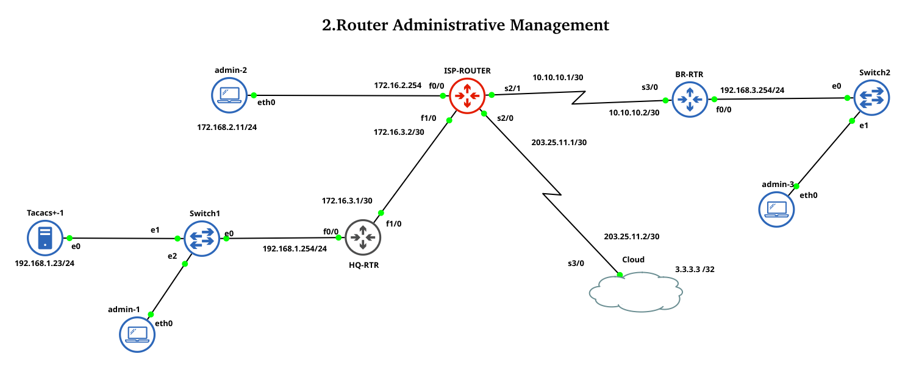

# Lab 2.1 — Router Administrative Management

> **CCNA-level lab** covering Cisco IOS user management, password security policies, SSH remote access, and clock configuration on a multi-router topology built in GNS3.



---

## Overview

This lab simulates a **small ISP network** with an ISP router, a headquarters (HQ) router, a branch (BR) router, and a Cloud router representing an internet cloud. You will configure administrative security features including local user accounts, password encryption, login blocking policies, and SSH remote access.

| Skill tested | IOS concept |
|---|---|
| Local user account creation | `username <name> privilege 15 secret` |
| Password encryption | `service password-encryption`, `enable secret` |
| Minimum password length | `security passwords min-length 8` |
| Login blocking (brute-force protection) | `login block-for`, `login on-failure`, `login on-success` |
| SSH remote access | `ip ssh version 2`, `transport input ssh` |
| Clock & timezone setup | `clock timezone`, `clock set` |

---

## IP Addressing Table

| Device | Interface | IP Address | Subnet Mask | Description |
|--------|-----------|------------|-------------|-------------|
| **Cloud** | Loopback0 | 3.3.3.3 | 255.255.255.255 | Loopback interface |
| | Serial3/0 | 203.25.11.2 | 255.255.255.252 | Link to ISP-RTR |
| **ISP-ROUTER** | FastEthernet0/0 | 172.16.2.254 | 255.255.255.0 | Link to local LAN |
| | FastEthernet1/0 | 172.16.3.2 | 255.255.255.252 | Link to HQ-RTR |
| | Serial2/0 | 203.25.11.1 | 255.255.255.252 | Link to Cloud |
| | Serial2/1 | 10.10.10.1 | 255.255.255.252 | Link to BR-RTR |
| **HQ-RTR** | FastEthernet0/0 | 192.168.1.254 | 255.255.255.0 | Link to local LAN |
| | FastEthernet1/0 | 172.16.3.1 | 255.255.255.252 | Link to ISP-ROUTER |
| **BR-RTR** | FastEthernet0/0 | 192.168.3.254 | 255.255.255.0 | Link to local LAN |
| | Serial3/0 | 10.10.10.2 | 255.255.255.252 | Link to ISP-ROUTER |

---

## Tasks

- [ ] **1.** Create 2 local users — `User1` (password: `Pass@1`) and `User2` (password: `Pass@2`) on all routers
- [ ] **2.** Encrypt all clear-text passwords (`service password-encryption`) and create MD5 encryption for enable password (`enable secret`)
- [ ] **3.** Set minimum password length policy to 8 characters (`security passwords min-length 8`)
- [ ] **4.** Configure login blocking: block user for **120 seconds** after **2 failed login attempts** within **30 seconds** (`login block-for 120 attempts 2 within 30`)
- [ ] **5.** Enable SSH v2 for remote access and restrict VTY lines to SSH only (`transport input ssh`)
- [ ] **6.** Set clock and timezone on all routers (`clock timezone`, `clock set`)

---

## Folder Structure

```
.
├── 0.Task/
│   ├── task.txt              # Lab task description
│   └── preview.html          # Interactive progress checklist
├── 1.Topology/
│   └── lab-2.png             # GNS3 topology screenshot
├── 2.Config_files/
│   ├── Cloud_i1_startup-config.cfg
│   ├── HQ-RTR_i2_startup-config.cfg
│   ├── ISP-ROUTER_i3_startup-config.cfg
│   ├── ISP-ROUTER_i3_private-config.cfg
│   ├── BR-RTR_i4_startup-config.cfg
│   └── BR-RTR_i4_private-config.cfg
├── 3.Tables/
│   └── ip_interfaces.csv     # IP addressing table (CSV)
├── 4.Captures/
│   └── *.pcapng              # Wireshark packet captures
├── Router Administrative Management/
│   ├── Router Administrative Management.gns3  # GNS3 project file
│   └── project-files/        # Dynamips / VPCS / QEMU files
└── README.md
```

---

## Requirements

| Tool | Version |
|------|---------|
| [GNS3](https://www.gns3.com) | 2.2+ |
| Cisco IOS image | c7200 / c3725 (or compatible) |
| [VPCS](https://github.com/GNS3/vpcs) | built into GNS3 |
| Wireshark | any recent release |

---

## Quick Start

1. **Clone** this repository.
2. Open `Router Administrative Management/Router Administrative Management.gns3` in GNS3.
3. Start all devices and wait for IOS boot.
4. Follow the tasks above — refer to `0.Task/task.txt` for details.
5. Use `2.Config_files/` as reference once you complete each router.

---

## Verification Commands

```
show users
show running-config | include username
show ip ssh
show clock
show login
ssh -l <username> <vty-ip>
```

---

## Keywords

`CCNA` `Cisco` `Router Administrative Management` `GNS3` `IOS` `User Management` `Password Security` `SSH` `SSH v2` `Login Blocking` `Brute Force Protection` `Password Encryption` `Enable Secret` `Service Password Encryption` `Minimum Password Length` `Clock Configuration` `Timezone` `VTY Lines` `Remote Access` `Network Lab` `Cisco IOS CLI`

---

## License

This lab is provided for **educational purposes**. Use at your own risk in a lab environment.

---

**Author:** Patrik &nbsp;|&nbsp; **Lab:** 2.1 &nbsp;|&nbsp; **Track:** CCNA – Network Fundamentals
